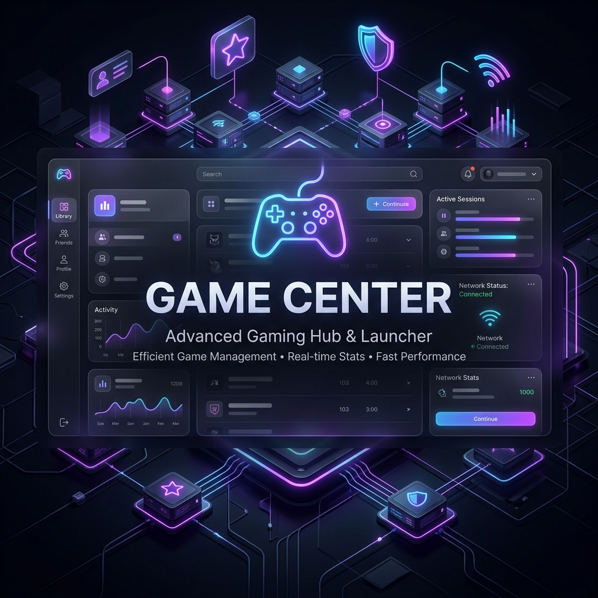
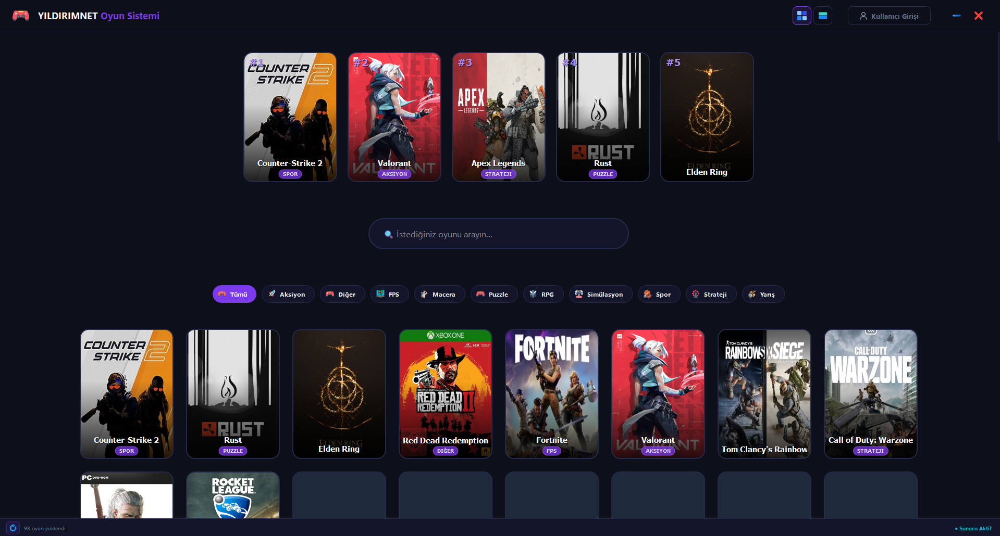
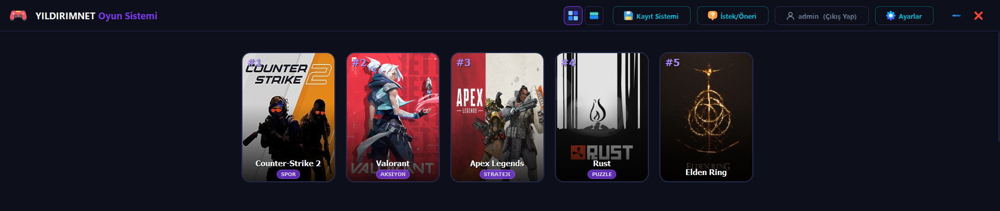
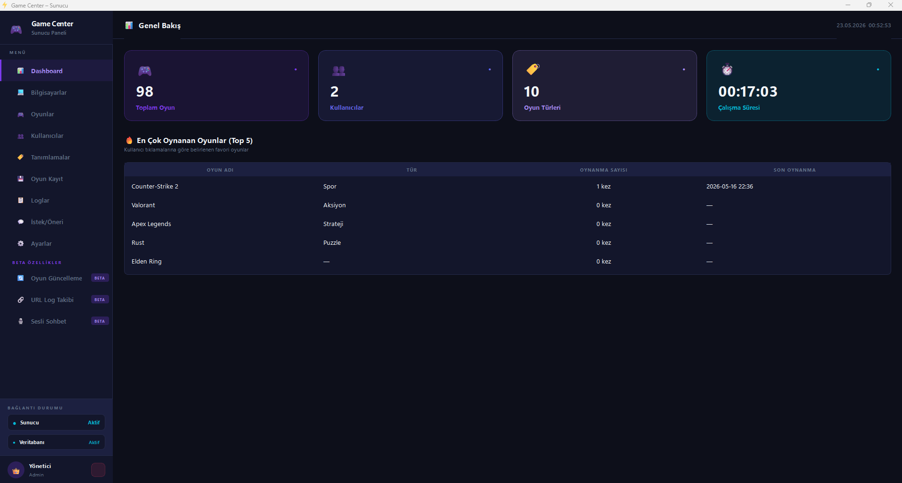

  

  # 🎮 Game Center
  
  **Modern, hızlı ve profesyonel ağ tabanlı oyun yönetim ve dağıtım platformu.**
  
  
  
  
  

---

## 🌟 Proje Hakkında

**Game Center**, internet kafeler, e-spor merkezleri veya evdeki yerel ağınız (LAN) için tasarlanmış modern bir oyun yönetim platformudur. İki ana bileşenden oluşur:
1. **Yönetim Sunucusu (Server):** Oyunları, kategorileri (Artık çift kategori destekli!), istemci bilgisayarları, save (kayıt) dosyalarını ve kullanıcıları merkezi olarak yönetir.
2. **Kullanıcı İstemcisi (Client):** Oyuncuların oyunları görüntülediği, detaylarına baktığı ve tek tıkla başlattığı pürüzsüz (glassmorphism) tasarımlı arayüz.

Gelişmiş önbellekleme (Caching), ETag HTTP 304 optimizasyonları ve Akıllı Yenileme (Smart Diff) algoritmaları ile **sıfır gecikme** ve **minimum ağ trafiği** hedeflenerek geliştirilmiştir.

---

## 🚀 Son Güncellemeler (v1.0.x)

- **LAN Sesli Sohbet & Global Bas-Konuş (PTT):** Ağ üzerinden çalışan, oyun içindeyken bile global klavye dinleme (Push-To-Talk) yapabilen VoIP sistemi eklendi (`ctypes` ile harici kütüphane gereksinimi olmadan Windows Core düzeyinde entegrasyon).
- **Çift Tür/Kategori Desteği (Dual-Genre):** Oyunlara artık iki farklı tür eklenebiliyor (Örn: FPS & Action). Özel badge (rozet) tasarımı ile client tarafında modern bir görünüm sunar.
- **Dinamik Kapak Görselleri:** İstemci tarafında favori ve diğer oyun kapakları ekran boyutlarına göre akıllıca ölçeklendirildi.
- **Gelişmiş Kurulum Paketleyicisi:** `Inno Setup` kullanılarak hem Client hem de Server için profesyonel `.exe` installer scriptleri derlendi (`GameCenter_Setup.iss`). Tüm bağımlılıklar ve görseller otomatik gömüldü.
- **Hata Çözümleri (Bug Fixes):** Login ekranında "Enter" tuşuna basıldığında uygulamanın çökmesi gibi UI/Event loop çakışmaları kalıcı olarak çözüldü. Arayüz elemanları (Sil butonu iconları vb.) güncellendi.

---

## 📸 Ekran Görüntüleri

### İstemci Arayüzü (Client)
*(Modern, pürüzsüz ve karanlık mod odaklı oyuncu arayüzü)*

  
  

### Sunucu Yönetim Paneli (Server)
*(Oyun, donanım, kullanıcı ve kayıt dosyası yönetim merkezi)*

  

---

## ✨ Temel Özellikler

- **Mükemmel Arayüz:** Modern Glassmorphism tasarımı, pürüzsüz animasyonlar ve şık karanlık mod.
- **LAN İçi Sesli İletişim:** Sunucuya ihtiyaç duymadan UDP Multicast/Broadcast mantığında Client-to-Client çalışan sesli sohbet.
- **Akıllı Ağ Kullanımı (Smart Sync):** Sadece değişen veriyi indirir, ağınızı yormaz. ETag ve Last-Modified destekli sunucu mimarisi.
- **Otomatik Setup Sihirbazları:** Inno Setup ile tek tıkla kurulum (IP yönlendirmeli ve sessiz yükleme destekli).
- **Gerçek Zamanlı Donanım Takibi:** İstemci bilgisayarlarının CPU, RAM, GPU sıcaklık ve yük durumunu canlı izleme.
- **Save Backup & Restore:** Oyun kayıt dosyalarını (Save Game) ağ üzerinden yedekleme ve geri yükleme sistemi.
- **Güvenlik & Yetkilendirme:** Admin yetkilendirmesi, şifreli haberleşme.

---

## 🚀 Kurulum ve Başlangıç

### 1. Gereksinimler
- Windows 10 veya 11 (64-bit)
- Python 3.11 veya üzeri (Geliştirici ortamı için)

### 2. Derleme (Build)
Projeyi sıfırdan derlemek için kök dizinde bulunan `.bat` dosyalarını çalıştırabilirsiniz:
- `build_all.bat`: Projeyi sıfırdan derler ve Installer (Setup) dosyasını otomatik paketler.
- Her iki bileşen de `PyInstaller` ve `Inno Setup` kullanılarak `Setup_Output` veya `dist` klasörü altında profesyonel birer kurulum dosyası (`.exe`) olarak oluşturulacaktır.

### 3. Kullanım
- Kurulum tamamlandıktan sonra oluşan güncel installer dosyasını (`Setup_Output\GameCenter_Setup_v1.0.exe`) çalıştırarak kurulumu tamamlayabilirsiniz.
- **Sunucu** kurulumunda veritabanı otomatik ayağa kalkar, **İstemci** kurulumunda ise bağlanılacak ana bilgisayar (Server) IP'si sorulur.

---

## 🛠️ Teknolojiler ve Mimari

* **Arayüz (Client & Server):** PyQt6, QThread (Asenkron İşlemler)
* **Sunucu Altyapısı:** Flask / FastAPI, SQLite3 (Veritabanı)
* **Derleme ve Paketleme:** PyInstaller, Inno Setup 6
* **Tasarım Dili:** Glassmorphism, CSS (QSS), Animasyonlu Geçişler
* **Sesli Sohbet:** PyAudio, Socket (UDP/TCP), ctypes (Global Key Hook)

---

## 📄 Lisans

Bu proje **MIT Lisansı** altında lisanslanmıştır. Detaylar için `LICENSE` dosyasına bakabilirsiniz.
